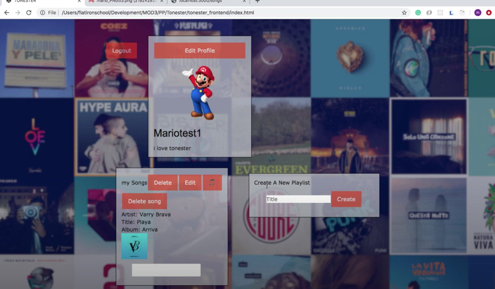

      

## Tonester_frontend

 

## Table of contents
* [General info](#general-info)
* [Technologies](#technologies)
* [images](#images)

## General info

Tonester was build using vanilla javascript for the frontend and rails for the backend. Tonester allows users to save albums using Spotify’s API.
	
## Technologies

Project is created with:
* JavaScript
* HMLT
* CSS

## Images

##### Login 
 

##### New User 
 

##### Profile 
 

